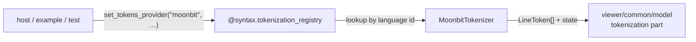

# syntax/lang_moonbit

The MoonBit lexer. It implements `@syntax.LineTokenizer` with a compile-time
`lexmatch` DFA, so there is no grammar file to load and no runtime regex engine.

`MoonBitTokenizer` is the whole public surface: hosts, examples, and tests select
it explicitly. Reusable viewer core packages must not import it — the viewer core
talks to `@syntax.TokenizationRegistry`, never to a concrete language.



## Reading a token stream

Every example on this page threads lexer state from one line to the next,
exactly as the model's whole-document sweep does.

```mbt check
///|
/// Renders each token as `text|tag`, carrying tokenizer state line to line.
fn annotate(
  tokenizer : &@syntax.LineTokenizer,
  lines : ArrayView[String],
) -> Array[String] {
  let rendered = []
  for line in lines; state = tokenizer.initial_state() {
    let (tokens, next_state) = tokenizer.tokenize_line(line, state)
    for token in tokens {
      rendered.push("\{line[token.start:token.end]}|\{token.tag}")
    }
    continue next_state
  }
  rendered
}
```

## Lexical classes

Keywords and literal boundaries follow ideas-master revision
`a642feeb2a891ae9cad4aa66de7c71d95ac7bca3`, specifically
`lib/xml/lex/{lex_keyword_tbl,lex_unicode,lex_unicode_lex}.ml` and
`lib/xml/parsing/parsing_parser.mly`. The rules are local; no compiler or grammar
is loaded at runtime. `package` is highlighted for interface files as well.

One rule consumes a complete identifier, including the compiler's Unicode
identifier blocks. Keyword-prefixed identifiers remain identifiers; reserved
words and obsolete `typealias`/`traitalias`/`fnalias` spellings do too. An
ASCII-capitalized identifier is classified as `Type`.

The only contextual heuristic colors lowercase names followed on the same line
by `(`, `!(`, or `?(` as `Function`, allowing whitespace. This covers ordinary
declarations and calls, including the soft keyword `extend`. Member names after
`.` bypass keyword classification, as in the compiler. The tokenizer does not
resolve bindings or infer types, and calls whose `(` is on another line retain
identifier color.

Numbers include radix integers with `U`/`L`/`UL`/`N` suffixes, decimal and hex
floats, `F` suffixes, and exponent separators. A float requires a decimal point,
as in the reference lexer. Range operators and chained tuple accessors preserve
their boundaries (`1..=3`, `pair.0.1`).

```mbt check
///|
test "declarations separate keywords, types, and values" {
  debug_inspect(
    annotate(@lang_moonbit.MoonBitTokenizer(), [
      "pub fn parse(input : String) -> Int {",
    ]),
    content=(
      #|[
      #|  "pub|Keyword",
      #|  "fn|Keyword",
      #|  "parse|Function",
      #|  "(|Delimiter",
      #|  "input|Identifier",
      #|  ":|Delimiter",
      #|  "String|Type",
      #|  ")|Delimiter",
      #|  "->|Operator",
      #|  "Int|Type",
      #|  "{|Delimiter",
      #|]
    ),
  )
}
```

Comments are two classes, not one: `///` documentation is `CommentDoc` while an
ordinary `//` line comment is `Comment`. That split is what lets documentation
render differently from dead code.

```mbt check
///|
test "doc comments and ordinary comments carry different tags" {
  debug_inspect(
    annotate(@lang_moonbit.MoonBitTokenizer(), [
      "/// Adds two numbers.", "// TODO: overflow", "///|",
    ]),
    content=(
      #|[
      #|  "/// Adds two numbers.|CommentDoc",
      #|  "// TODO: overflow|Comment",
      #|  "///||CommentDoc",
      #|]
    ),
  )
}
```

Strings expose their escapes and interpolations as separate tokens, so a
mis-escaped literal is visible without re-lexing the string body.
`re"..."` uses `Regexp` for its text and the same nested interpolation rules as
ordinary and byte strings. Hex, octal, and Unicode escapes are highlighted as
whole escapes. Incomplete literals remain highlightable while editing; this
tokenizer does not report lexical or parser errors.

```mbt check
///|
test "escapes and interpolation are separate tokens inside a string" {
  debug_inspect(
    annotate(@lang_moonbit.MoonBitTokenizer(), [
      "let greeting = \"hi \\{name}\\n\"",
    ]),
    content=(
      #|[
      #|  "let|Keyword",
      #|  "greeting|Identifier",
      #|  "=|Operator",
      #|  "\"hi |String",
      #|  "\\{|StringEscape",
      #|  "name|Identifier",
      #|  "}\\n|StringEscape",
      #|  "\"|String",
      #|]
    ),
  )
}
```

Multiline string rows (`#|` and `$|`) are recognized per line, which is why a
snapshot literal inside this very file tokenizes cleanly.

```mbt check
///|
test "multiline string rows are recognized per line" {
  debug_inspect(
    annotate(@lang_moonbit.MoonBitTokenizer(), [
      "  #|literal row", "  $|interpolated \\{x}",
    ]),
    content=(
      #|[
      #|  "#|literal row|String",
      #|  "$|interpolated |String",
      #|  "\\{|StringEscape",
      #|  "x|Identifier",
      #|  "}|StringEscape",
      #|]
    ),
  )
}
```

Package-qualified references and attributes are their own shapes rather than
being smeared into neighbouring identifier tokens.

```mbt check
///|
test "package references and attributes keep their structure" {
  debug_inspect(
    annotate(@lang_moonbit.MoonBitTokenizer(), [
      "#deprecated", "let v = @base_common.Position(1, 1)",
    ]),
    content=(
      #|[
      #|  "#deprecated|Attribute",
      #|  "let|Keyword",
      #|  "v|Identifier",
      #|  "=|Operator",
      #|  "@base_common|Type",
      #|  ".|Delimiter",
      #|  "Position|Type",
      #|  "(|Delimiter",
      #|  "1|Number",
      #|  ",|Delimiter",
      #|  "1|Number",
      #|  ")|Delimiter",
      #|]
    ),
  )
}
```

## State

`lang_moonbit` always returns the empty normal `TokenizerState()`, so its mode
stack is private per-line scratch: nothing this lexer recognizes spans a line
boundary. Re-lexing any single line is therefore always safe, regardless of
what precedes it.

```mbt check
///|
test "the returned state is always the base mode" {
  let tokenizer : &@syntax.LineTokenizer = @lang_moonbit.MoonBitTokenizer()
  let (_, after_open) = tokenizer.tokenize_line(
    "let s = \"unterminated",
    tokenizer.initial_state(),
  )
  debug_inspect(
    (tokenizer.initial_state(), after_open),
    content=(
      #|(TokenizerState(""), TokenizerState(""))
    ),
  )
}
```

## Boundaries and checks

This package may depend only on `syntax`. It owns no registry, no diagnostics,
and no semantic tokens. The complete API is `pkg.generated.mbti`; the
line-tokenizer contract, the shared helpers, and the porting rules for adding a
language live in `syntax/README.mbt.md`.

```sh
moon test --target js syntax/lang_moonbit
```
