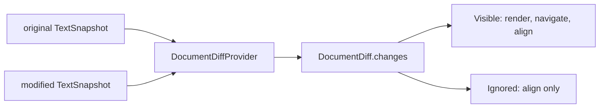

# viewer/common/diff

Renderer-neutral document-diff contracts and the built-in synchronous diff
provider. The package has no DOM or editor-widget dependency.



## Computing a diff

The built-in provider accepts immutable, LF-normalized snapshots. A line
change may also contain one-based UTF-16 character mappings.

```mbt check
///|
let strict_options : @diff.DocumentDiffOptions = {
  ignore_trim_whitespace: false,
}

///|
test "an edited line maps original and modified ranges" {
  let result = @diff.get_line_document_diff_provider().compute_diff(
    TextSnapshot("fn main {\n  println(1)\n}"),
    TextSnapshot("fn main {\n  println(2)\n}"),
    strict_options,
  )
  assert_eq(result.changes.length(), 1)
  assert_eq(result.changes[0].mapping.original, LineRange(2, 3))
  assert_eq(result.changes[0].mapping.modified, LineRange(2, 3))
  assert_true(result.changes[0].kind is Visible)
}
```

An insertion has an empty original range; a deletion has an empty modified
range. Identical inputs produce no changes.

```mbt check
///|
test "insertions keep half-open line-range semantics" {
  let inserted = @diff.get_line_document_diff_provider().compute_diff(
    TextSnapshot("a\nc"),
    TextSnapshot("a\nb\nc"),
    strict_options,
  )
  assert_eq(inserted.changes.length(), 1)
  assert_true(inserted.changes[0].mapping.original.is_empty())
  assert_eq(inserted.changes[0].mapping.modified, LineRange(2, 3))
}
```

## Advanced line diff

`LineDocumentDiffProvider` exposes the built-in line-diff implementation and
`DocumentDiff` contract, but its private pipeline ports the readability-critical
parts of VS Code's Advanced diff from pinned revision
`07c20d96cf3f2cbc8142ac7079ba9048cf7f6134`. The port mode is
**algorithm-fidelity**: thresholds, score/tie order, shift bounds, repeated
join order, and short-match constants are preserved; MoonBit-native concrete
records and closures replace TypeScript interfaces.

| Behavior or invariant | Pinned source | Disposition | Evidence |
|---|---|---|---|
| Weighted DP for short line/scalar sequences; Myers fallback | `defaultLinesDiffComputer.ts:67-94,221-225`; `dynamicProgrammingDiffing.ts` | Implemented with `<1700` and `<500` thresholds | `advanced_diff_reference_wbtest.mbt`; all existing reconstruction tests |
| Two-pass join, boundary-scored shift, `100` shift cap | `heuristicSequenceOptimizations.ts:12-180` | Implemented for line and Unicode-scalar sequences | `shifting-parameters` and `ts-diff-word-split` reference cases |
| Merge substantial hunks around at most four non-whitespace UTF-16 units; merge scalar matches of length at most two | `heuristicSequenceOptimizations.ts:183-206,321-369` | Implemented | deterministic structural-refactor reference case |
| Whole-word refinement without splitting shared identifiers | `heuristicSequenceOptimizations.ts:208-319`; `linesSliceCharSequence.ts:104-129` | Implemented over Unicode-scalar storage and ASCII word classification | `word-shared-letters` reference case; `Array` to `FixedArray` regression case |
| Coalesce tiny one-line matches between long changes and absorb short line trim | `heuristicSequenceOptimizations.ts:372-472` | Implemented with UTF-16 thresholds over scalar offsets | exact `20/21` and `100/101` boundary reference cases |
| Canonical newline mappings for whole-line additions and deletions | `rangeMapping.ts:132-170`; `linesSliceCharSequence.ts:20-49,101-117` | Implemented with separate right/left offset boundaries | leading, middle, trailing, final-newline, and trimmed-successor reference cases |

The following upstream clusters are deliberately deferred: option-controlled
subword forcing (`extendToSubwords`) because the frozen local
`DocumentDiffOptions` has no such policy field; timeouts; moved block detection;
and external/wasm providers. Unicode scalar values remain atomic locally
(unlike upstream UTF-16 code-unit storage), while behavior thresholds and
emitted columns remain UTF-16 based.

## Whitespace and provider policy

`ignore_trim_whitespace` ignores only whitespace at each line's edges. The
contract deliberately has no fake millisecond timeout, timeout result, or move
option: providers expose only semantics they implement.

```mbt check
///|
test "trim whitespace can ignore re-indentation" {
  let provider = @diff.LineDocumentDiffProvider()
  let original = @model.TextSnapshot("fn main {\nprintln(1)\n}")
  let modified = @model.TextSnapshot("fn main {\n  println(1)\n}")
  let strict = provider.compute_diff(original, modified, strict_options)
  let lenient = provider.compute_diff(original, modified, {
    ignore_trim_whitespace: true,
  })
  assert_eq(strict.changes.length(), 1)
  assert_true(lenient.changes.is_empty())
}
```

External providers implement `DocumentDiffProvider` and return a single ordered
`changes` list. Each `DocumentDiffChange` contains a `kind` (`Visible` or
`Ignored`) and a `DetailedLineRangeMapping`. All entries drive alignment;
only `Visible` entries drive decorations, overview markers, Inline deleted
blocks, and navigation. Visibility describes the current computation, not the
source's semantic category. Changing an ignore policy requires recomputing the
provider result; ignored entries need not retain renderable character diffs.

`DocumentDiffChange`, `LineRangeMapping`, `DetailedLineRangeMapping`, and
`RangeMapping` are public constructible values, so no viewer-layer adapter is
required. Touching changes of the same kind must be grouped. Different kinds
may touch; all mappings remain ordered and non-overlapping on both sides, with
equal unchanged gaps. `normalize_and_validate_document_diff` is the shared
contract boundary: optional providers can reject a specialized candidate and
fall back before publishing their effective mode, while the ViewModel invokes
the same helper again before rendering any provider result. Invalid generic
providers still enter the ViewModel's `Failed` state rather than being repaired
in the renderer.

```sh
moon test --target js viewer/common/diff
```
